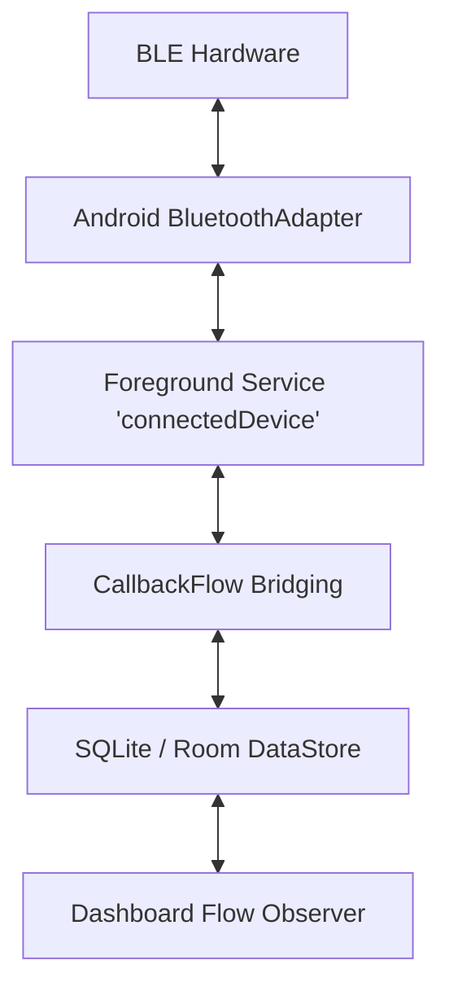

# System Design: BLE Wearable Sync App (Staff Level)

This document outlines the architecture, data flow, and critical edge cases for building a stable, battery-efficient application that communicates consistently with IoT / Bluetooth Low Energy devices.

---

## 1. Requirements & Constraints
*   **Functional:** Discover nearby proprietary hardware (smart rings, glucose monitors), establish a persistent connection, and fetch high-frequency raw sensor data.
*   **Non-Functional (Performance):** Android's Bluetooth stack aggressively kills idle connections; your app must run 24/7 in the background without draining the battery.
*   **Non-Functional (Security):** Protect proprietary BLE characteristic payloads from being intercepted by malicious Bluetooth sniffers running on the same phone.

---

## 2. High-Level Architecture Diagram


---

## 3. Core Components & Data Flow

### A. Bridging the Nightmare of `BluetoothGattCallback`
The native Android BLE API is heavily asynchronous and relies on nested legacy callbacks (`onServicesDiscovered`, `onCharacteristicRead`). 
-   **Implementation:** Wrap the entire GATT state machine inside a `callbackFlow`. 
-   This converts the unpredictable multi-threaded responses into a clean, sequential Kotlin Flow that can be observed cleanly.

### B. High-Frequency UI Updates (Conflation)
**The Scenario:** A smart ring's accelerometer calculates steps at 100Hz. Emitting to a `StateFlow` 100 times a second will cause the main thread to freeze.
-   **The Solution:** Do not send raw characteristics directly to the UI layer. 
-   In the Repository/Service layer, apply the `.conflate()` or `.sample(100.milliseconds)` operator.
-   The Service can dump the 100 raw ticks into a fast `ArrayMap` buffer for local persistent storage, but the UI is throttled to safely draw at 10 frames per second.

---

## 4. Resilience & Background Constraints

The biggest enemy of a BLE app is the Android OS deciding that your background app is "wasting power" and terminating the connection.

### A. Lifecycle Survival
You cannot keep a ViewModel alive overnight.
1.  **Foreground Service:** You must elevate to a Foreground Service and declare the strict Android 14+ type: `connectedDevice`. This explicitly tells the OS that the persistent Notification exists to maintain an active GATT socket.
2.  **Auto-Reconnection:** BLE signals bounce off walls and bodies. Disconnections are inevitable. In your `callbackFlow`, implement an exponential retry mechanism:
    ```kotlin
    bleFlow.retryWhen { cause, attempt ->
        if (cause is BleGattException) {
            delay(1000L * attempt) // 1s, 2s, 3s...
            true 
        } else false
    }
    ```

### B. CPU Sleep vs WakeLocks
-   **The Trap:** If you hold a `WakeLock` to process BLE data overnight, you will destroy the phone's battery.
-   **The Fix:** Instruct the hardware device to log data internally. Create an `AlarmManager` or `PeriodicWorkRequest` to wake the CPU once an hour, establish the BLE connection, burst-download the cached telemetry array, write it to `Room`, and let the CPU return to deep sleep instantly.

---

## 5. Security & Isolation

Bluetooth broadcast data is basically public. 

### A. E2EE (Application Layer Encryption)
**The Problem:** Any app with `BLUETOOTH_CONNECT` permissions installed on the phone can eavesdrop on your GATT characteristics. 
**The Solution:** Do not rely on native BLE standard pairings alone.
1.  When the app and ring pair, perform a cryptographic Diffie-Hellman Key Exchange (ECDH) over the BLE channel.
2.  From that point forward, every single GATT read/write consists of completely AES-GCM encrypted byte arrays. 
3.  If a sniffer app hooks into the Android Bluetooth Manager, they only see unintelligible garbage, protecting proprietary Harman health algorithms from reverse engineering.
