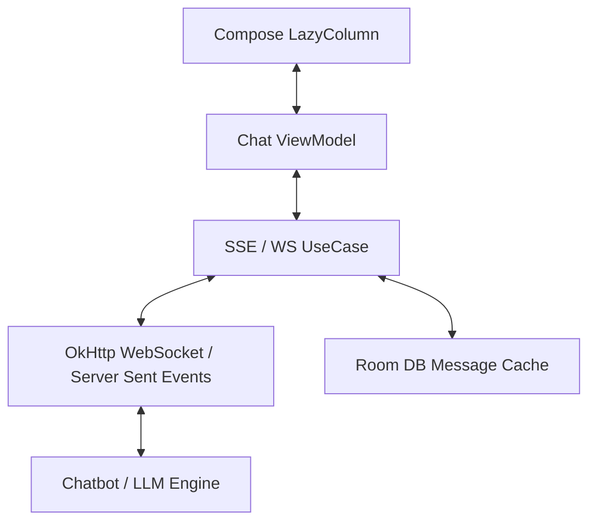

# System Design: AI Chat Bot / Support Assistant (Staff Level)

This document outlines the architecture for embedding a real-time, LLM-powered (or live-agent) Customer Support Chat Bot inside a native Android application.

---

## 1. Requirements & Constraints
*   **Functional:** Real-time bi-directional messaging, rich UI components (carousel, quick replies), token-streaming (for LLM typing effects), and seamless handoff to a human agent.
*   **Non-Functional (Performance):** The UI must render 60fps while appending streaming text tokens. Smooth scrolling to the bottom of the list.
*   **Non-Functional (Security):** The chat window is highly authenticated; no session hijacking allowed.

---

## 2. High-Level Architecture Diagram

---

## 3. Core Components: Real-Time Communication

Unlike standard REST APIs, a chatbot requires a persistent, bi-directional connection.

### A. WebSockets (WS) vs Server-Sent Events (SSE)
-   **Trade-off:** 
    -   *WebSockets* are truly bi-directional but harder to load-balance on the backend.
    -   *SSE (Server-Sent Events)*: The Android app sends a message via standard HTTP `POST`, and listens for the LLM token stream via an open HTTP `GET` connection.
-   **Staff Decision:** For an LLM chatbot, **SSE** is vastly superior. It handles token streaming beautifully and naturally flows through standard HTTP proxies/firewalls.

### B. Handling Token Streaming & UI Jank
-   **Problem:** An LLM generates responses one token (word) at a time. Emitting every single letter down the Kotlin Flow into a Compose `LazyColumn` will trigger massive recompositions, causing the scroll to stutter uncontrollably.
-   **Solution:** 
    1. Buffer tokens in the ViewModel using a slight `debounce(50L)` or by manually concatenating the string state before pushing to the main UI list.
    2. Ensure the `LazyColumn` uses `key = { message.id }` so Compose knows exactly which row is updating (the bottom one) and doesn't re-measure the entire 50-message chat history.

---

## 4. Resilience & Offline State

**The Scenario:** The user types a message, drives into a tunnel, and hits "Send."

### A. The Optimistic UI & Local Cache
-   **Implementation:**
    1.  The instant the user hits "Send", write a dummy `Message(status = PENDING)` to the local `Room` database. 
    2.  The UI is observing the database, so the message instantly appears in the chat bubble.
    3.  A background coroutine (or `WorkManager` for critical claims questions) attempts the network transmission.
    4.  If it fails, update the DB to `Message(status = FAILED_RETRY)`. The UI reacts by showing a red `!` icon with a "Tap to Retry" button.

### B. Pagination & History
-   **Problem:** Chat logs can be thousands of messages long. Attempting to hold them all in memory crashes the app.
-   **Solution:** Use the **Jetpack Paging 3** library.
    -   Connect Paging 3 to the `Room` database (`PagingSource`).
    -   As the user scrolls up, Paging 3 automatically queries the network for older pages, inserts them into Room, and the UI dynamically expands.

---

## 5. Security & Context Handoff

### A. Authenticated Sessions Context
-   **Problem:** When a user talks to the bot, the bot must securely know the user's active policy details without forcing the user to re-authenticate.
-   **Solution:** 
    - The initial WebSocket handshake (or the SSE connection header) must pass a short-lived **Oauth2 Bearer Token** (read from `EncryptedSharedPreferences`).
    - The backend explicitly binds the WebSocket session ID to the User ID.

### B. Human Agent Handoff (The "Takeover")
-   If the NLP engine fails to understand the user 3 times, or the user types "Speak to agent", the backend shifts the WebSocket route to a live human operator dashboard. 
-   The Android app doesn't need to rebuild the connection; the Backend sends a payload `{"type": "SYSTEM", "text": "Agent Sarah has joined the chat"}`. The Android UI parses the `type` flag and renders a distinct system-announcement bubble.
