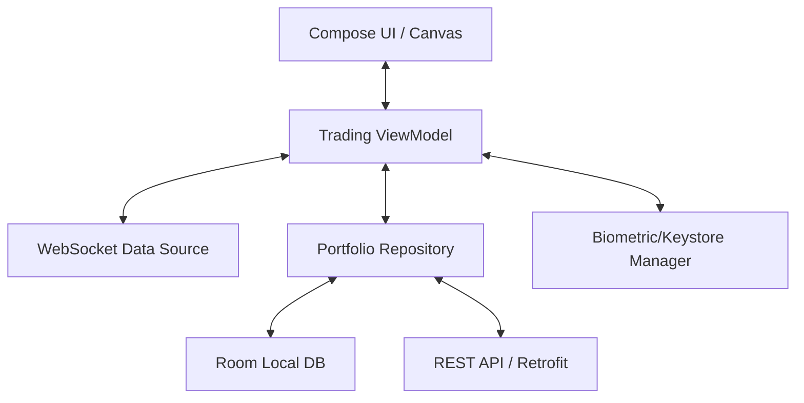

# System Design: Digital Gold Trading App (Staff Level)

This document outlines the architecture, data flow, and critical edge cases for building a high-frequency Digital Gold trading platform on Android, meeting the expectations of a Staff/Principal Engineer.

---

## 1. Requirements & Constraints
*   **Functional:** View real-time gold prices without stutter, execute fractional buy/sell orders securely, view portfolio offline.
*   **Non-Functional (Performance):** 60Hz UI renders for live graphs, minimal battery drain during extended trading sessions.
*   **Non-Functional (Security):** Bank-grade APIs, transaction non-repudiation, protection against physical device theft.

---

## 2. High-Level Architecture Diagram


---

## 3. Core Components & Data Flow

### A. The Real-Time Price Ticker (WebSockets)
We cannot rely on REST polling for a live trading app. 
-   **Implementation:** Use OkHttp's WebSocket API.
-   **Bridging to Coroutines:** Wrap the WebSocket listener in a `callbackFlow`. 
-   **The Firehose Problem:** The broker might push price ticks at 20-50Hz. The Android UI renders at 60Hz (16.6ms per frame). Updating Compose state 50 times a second will cause massive Garbage Collection and dropped frames.
-   **Solution:** Use Kotlin Flow Operators to throttle the stream:
    ```kotlin
    val stabilizedPriceFlow = rawWebsocketFlow
        .conflate() // Drop intermediate prices if UI is too slow to draw them
        // OR
        .sample(50.milliseconds) // Guarantee max 20 updates per second
        .stateIn(viewModelScope, SharingStarted.WhileSubscribed(5000), InitialPrice)
    ```

### B. Offline-First Portfolio (Room)
The user's purchased balance and past receipts must be visible immediately on app launch, even in an elevator.
-   **Implementation:** The UI only ever reads from the local SQLite `Room` database (Single Source of Truth).
-   **Syncing:** When the network becomes available, a `WorkManager` job fetches the delta from the server and updates Room. The UI automatically reacts.

---

## 4. Resilience & The "App Kill" Edge Case

**The Scenario:** The user enters $50,000 to buy gold. They tap "Confirm". The `Retrofit` POST request fires. *At that exact millisecond*, a native phone call comes in, pushing the app to `onStop()`, and the low-memory Android OS instantly kills the trading app. Did the transaction go through? Does the user owe money?

**The Solution:**
Never tightly couple financial execution to the UI `ViewModel`/`lifecycleScope`.
1.  When "Confirm" is pressed, enqueue a **WorkManager Expedited Job** (`OneTimeWorkRequest`).
2.  If the app dies, WorkManager's dedicated process guarantees the HTTP request completes.
3.  Once the server returns `200 OK`, the Worker updates the `Room` database portfolio balance.
4.  The Worker fires a local system **Notification** ("Trade Successful") so the user knows what happened even if they never open the app again.

---

## 5. Security & Authentication

A session token in `SharedPreferences` is not enough. If someone steals the phone while unlocked, they can drain the digital gold balance.

### A. Transaction-Level Biometrics
We must enforce intent using hardware.
-   **Setup:** Generate an RSA/EC asymmetric key pair in the Android Keystore. Crucially, set `.setUserAuthenticationRequired(true)` and `.setUserAuthenticationValidityDurationSeconds(-1)`.
-   **Execution:** The `-1` validity means the Keystore locks the key immediately after passing it to the cryptographic cipher.
-   **The Flow:** The user hits "Buy". The app presents `BiometricPrompt`. Only upon successful fingerprint/face scan will the OS unlock the hardware key for a split second, allowing the app to sign the HTTP payload. The backend verifies this signature.

### B. Network Hardening
Implement **Certificate Pinning** (`CertificatePinner`) on the OkHttp client to prevent Man-In-The-Middle attacks from proxy routers. Pin the intermediate Root CA, not the leaf, to prevent accidental app bricking when the server cert rotates.
