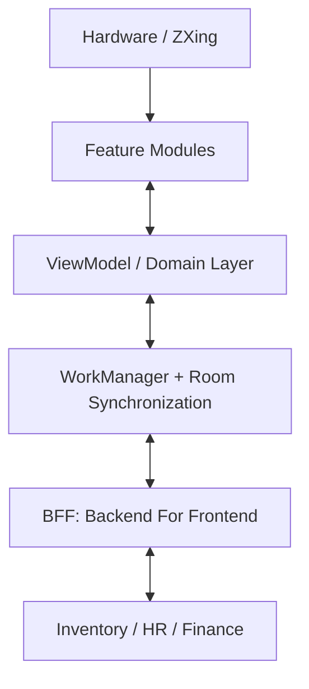

# System Design: ERP (Enterprise Resource Planning) Application (Staff Level)

This document outlines the architecture, data flow, and critical edge cases for building a massive, modular Enterprise application. ERPs differ from consumer apps due to scale: they manage Inventory, HR, Finances, and Supply Chains simultaneously across thousands of employees. 

---

## 1. Requirements & Constraints
*   **Functional:** Support field-workers (warehouse, logistics) operating in total dead-zones. Support complex Role-Based Access Control (RBAC). Handle high-speed barcode/RFID scanning.
*   **Non-Functional (Scale):** The codebase will be worked on by 5+ disjointed squads. Build times must be strictly controlled via modularity.
*   **Non-Functional (Resilience):** The app is mission-critical. If warehouse workers can't scan items, millions of dollars are lost per hour.

---

## 2. High-Level Architecture Diagram

---

## 3. Core Components: Offline-First & Sync Engines

An ERP used in a metal warehouse or a remote mine will frequently lose connection. It must function "Offline-First".

### A. The Conflict Resolution Strategy
-   **Problem:** User A in the warehouse marks "Pallet 402" as shipped *offline*. User B on a desktop marks "Pallet 402" as damaged. When User A gets a 4G signal, how do they sync?
-   **Solution:** Implement a **Version Vector / Sync Token** system.
    1.  The Android `Room` entity stores an `updatedAt` and a `syncStatus` flag (`SYNCED`, `PENDING_UPDATE`, `PENDING_DELETE`).
    2.  When back online, a `WorkManager` job pulls the latest server changes first.
    3.  If a conflict exists on the same `pallet_id`, the Backend dictates the resolution strategy (e.g., "Supervisor edits override Worker edits" or "Last Write Wins").
    4.  The Android device drops its pending change into a "Conflict Queue" UI for manual supervisor review if the backend rejects the sync.

### B. Massive Local Databases (Room)
-   **Problem:** An ERP might need to cache 100,000 inventory items locally for full-text search. Querying this on the main thread is impossible.
-   **Solution:** Use **Room with FTS4 (Full-Text Search)**.
    -   Tag the `Entity` with `@Fts4`. This creates a hidden virtual table optimized specifically for matching string queries instantly.
    -   Connect `Room` directly to `Paging 3`. The UI lazily requests chunks of 50 items at a time while scrolling the `LazyColumn`, eliminating OOMs (Out of Memory errors) entirely.

---

## 4. Resilience: Hardware & Modularity

### A. Dedicated Barcode Scanners (Zebra/Honeywell)
-   **Requirement:** Warehouse workers scanning 1 box per second cannot wait for a CameraX preview to lock focus.
-   **Implementation:** Enterprise apps run on dedicated rugged devices (like Zebra TC series).
-   Do not use the camera. Register Android `BroadcastReceivers` that listen for the proprietary DataWedge intents fired by the dedicated hardware laser over the OS bus. Send this stream into a `callbackFlow` observed by the ViewModel.

### B. Multi-Module Project Structure (Build Times)
-   **Problem:** If the HR team changes a color, and the Inventory team is forced to wait 15 minutes for Gradle to rebuild the Monolith, developer velocity dies.
-   **Solution:** Strict **Feature Modularity**.
    -   `:app` (Only assembles the modules)
    -   `:feature:inventory`
    -   `:feature:hr`
    -   `:core:designsystem` (Common Compose UI components)
    -   `:core:network` (Retrofit, Ktor)
    -   Dependency Injection (`Koin`/`Hilt`) wires the isolated features together at runtime via interfaces, ensuring `:feature:inventory` knows *absolutely nothing* about `:feature:hr`, enabling parallel Gradle compilation.

---

## 5. Security & Access Control

### A. Granular RBAC (Role-Based Access Control)
-   **Problem:** A logistics driver cannot see the CFO's financial dashboards, but they both use the exact same APK.
-   **Solution:** Feature Toggling via **Backend-Driven UI (BDUI)**.
    -   Upon login, the backend passes a JWT containing the user's roles (`logistic_driver`, `manager`).
    -   The app fetches a specific JSON layout/configuration payload.
    -   The Navigation Graph uses dynamic routes based on the permissions block in `SharedPreferences`. The app does not hardcode button visibility; it reads a configuration map `if (permissions.contains("VIEW_FINANCE"))`.
    -   *Security Fail-safe:* Even if a hacker modifies the APK to display the "Finance" button, the Backend BFF (Backend For Frontend) strictly validates the JWT on every request and throws a `403 Forbidden`.
