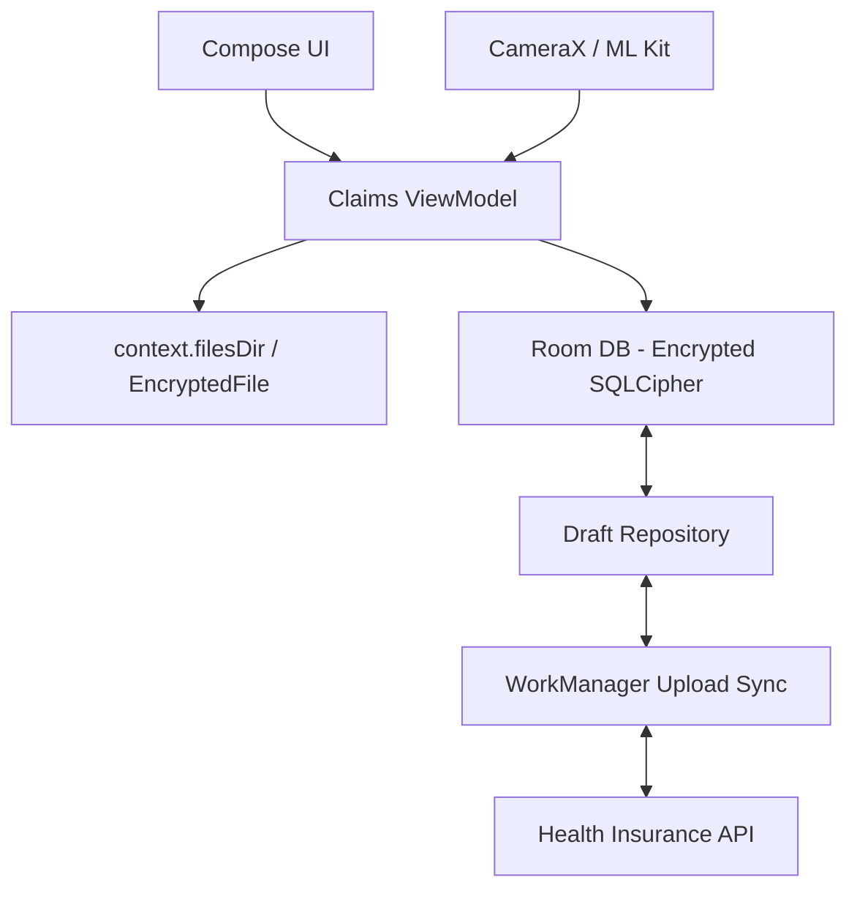

# System Design: Health Insurance (Staff Level)

This document details the architecture for a Health Insurance mobile application, focusing heavily on document ingestion, optical character recognition (OCR), strict data privacy constraints, and complex state management across user profiles.

---

## 1. Requirements & Constraints
*   **Functional:** Submit medical bills for reimbursement, view policy coverage/E-cards, and manage claims for entire family trees (dependents).
*   **Non-Functional (Performance):** Perform on-device image processing to flatten and crop medical bills before uploading.
*   **Non-Functional (Security):** Strict HIPAA compliance (or regional equivalents like GDPR/DPDP). Medical PII must be encrypted at rest and totally isolated.

---

## 2. High-Level Architecture Diagram

---

## 3. Core Components: Bill Ingestion & OCR

Submitting a 10-page hospital bill is the core user journey. 

### A. Edge Machine Learning (ML Kit)
-   **Problem:** Uploading 10 blurry, 12MP photos of bills to the backend for OCR costs massive AWS server time and fails on slow cell connections.
-   **Solution:** Shift computations to the Edge (the phone).
    - Use `CameraX` combined with **Google ML Kit Document Scanner API**.
    - The ML Kit API natively detects document edges, auto-crops, flattens the perspective, and enhances contrast instantly on the GPU/NPU.
    - Run on-device Text Recognition (OCR) to extract the "Total Amount" and "Hospital Name" *before* upload, auto-filling the draft form to save user typing.

### B. Reliable Document Uploads
-   **Architecture:** The scanned PDFs are written to internal storage. A sequence of `WorkManager` jobs handles the upload. If the app is killed, the upload continues gracefully in the background process.

---

## 4. Resilience: Family Profile State Management

Health insurance accounts often contain the Primary member, a Spouse, and multiple Children. Each has different claim histories and coverage limits.

### A. Session & State Leaks
-   **Problem:** When switching between viewing "Dependent 1's Claims" and "Dependent 2's Claims", the UI accidentally flashes caching details from the wrong person.
-   **Solution:** Strict Unidirectional Data Flow (UDF) using Kotlin Flow.
    -   The `Room` database acts as the single source of truth. 
    -   The UI observes `repository.getClaimsFor(activeProfileId).collectAsState()`.
    -   When `activeProfileId` changes, `flatMapLatest` instantly cancels the old database query and spins up the new one, guaranteeing the data hitting the UI perfectly matches the selected profile.

---

## 5. Security & Isolation

Medical data is the most targeted PII by hackers. 

### A. SQLCipher & Master Key Management
-   **Data At Rest:** The local `Room` database caches policy details, claim history, and diagnosis codes. It MUST be encrypted.
-   **Implementation:** 
    - Use `SQLCipher`. 
    - The 256-bit passphrase used to open the SQLCipher database is heavily randomized and securely encrypted inside `EncryptedSharedPreferences`. 
    - The Master Key unlocking the SharedPreferences is locked safely inside the Android Keystore (Trusted Execution Environment).

### B. Scoped Storage / PDF Protection
-   **Problem:** Downloading an E-Card (PDF) or medical bill to `/Downloads` exposes it to malicious file manager apps.
-   **Solution:** 
    - Write all PDFs into `context.filesDir`. 
    - If the user wants to view it, use Android's `FileProvider` to grant temporary read-only Uri access to a PDF Viewer app.
    - If the user explicitly wants to export it, use the `Storage Access Framework` (`ACTION_CREATE_DOCUMENT`), forcing the OS to handle the security perimeter.
