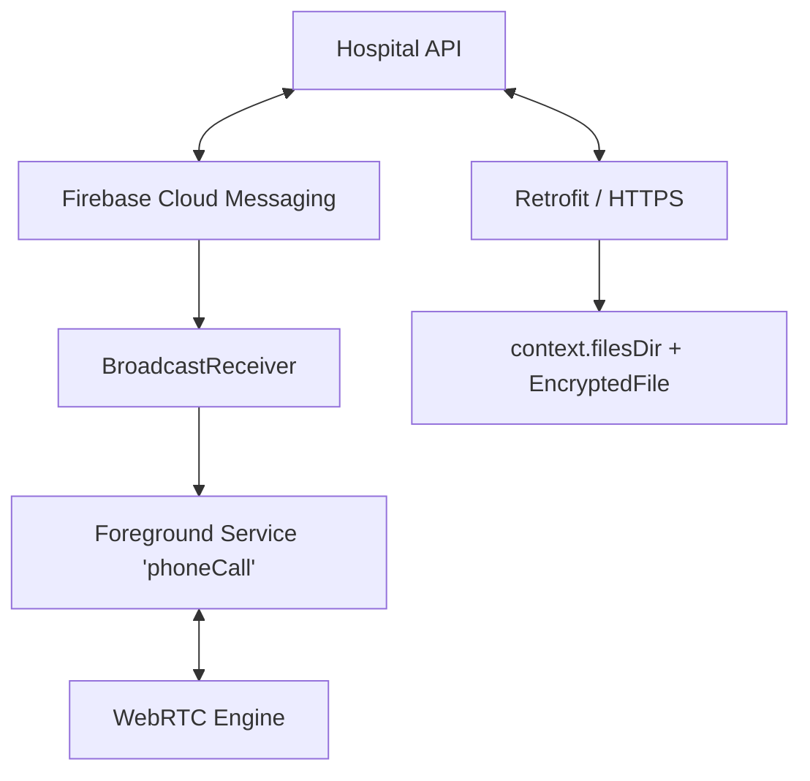

# System Design: Telemedicine & Secure Consultations (Staff Level)

This document outlines the architecture, data flow, and critical edge cases for building a HIPAA-compliant medical consultation and WebRTC app on Android.

---

## 1. Requirements & Constraints
*   **Functional:** Allow doctors/patients to schedule appointments, download encrypted lab results, and connect via peer-to-peer video.
*   **Non-Functional (Performance):** Video must not thermal-throttle the device during a 60-minute call.
*   **Non-Functional (Security):** Strict HIPAA compliance. PII and Medical PDFs must be cryptographically protected from other apps and physical extraction.

---

## 2. High-Level Architecture Diagram

---

## 3. Core Components & Data Flow

### A. The Sleeping App Problem (FCM Push)
**The Scenario:** The app is completely closed. A doctor initiates a WebRTC call. How do you wake the phone, show a full-screen ringing UI, and establish the ICE connection instantly?
-   **Implementation:**
    1.  The backend sends an **FCM High-Priority Data Message** (do NOT use a standard Notification Message, as the OS handles those differently).
    2.  The Android `BroadcastReceiver` catches the payload in the background.
    3.  It instantly starts a **Foreground Service** with the mandatory `phoneCall` type (Android 14+).
    4.  It fires a `Notification` with a `fullScreenIntent` (triggering an Activity that looks like the native ringing screen).
    5.  The Foreground Service handles the WebRTC signaling while the UI rings.

### B. Long-Running Video (Thermal Throttling)
Encoding 1080p video in software will heat up a phone within 10 minutes, causing AOSP to disable CPU cores ("Thermal Throttling"), resulting in crashed calls.
-   **Hardware Acceleration:** Ensure your WebRTC implementation is forcefully injecting the `HardwareVideoEncoderFactory`.
-   **Active Monitoring:** Construct a BroadcastReceiver listening for `PowerManager.ACTION_THERMAL_STATUS_CHANGED`.
-   When `THERMAL_STATUS_MODERATE` hits, automatically downgrade video bitrates. 
-   When `THERMAL_STATUS_SEVERE` hits, pause the local Camera stream entirely, converting the session to an Audio-Only call to save the battery and cool the hardware.

---

## 4. Resilience & The Multi-Window Edge Case

**The Scenario:** The patient is on a live video call. They get a text message and briefly pull down the Android Notification Shade to reply.
-   **The Trap:** Novice developers pause the Camera and Video streams inside `onPause()`.
-   **The Fix:** Pulling down the notification shade (or using split-screen) fires `onPause()`, but the Activity is still visible. **Never pause video in `onPause()`.** Only release the camera hardware and stop the `SurfaceView` when the app hits `onStop()` (completely invisible).

---

## 5. Security & HIPAA Compliance

 Medical records (PDF prescriptions, X-rays) must be deeply isolated.

### A. Scoped Storage Isolation
-   Never download a patient's lab PDF to the public `/Downloads` folder.
-   Write the raw bytes directly to **Internal App-Specific Storage** (`context.filesDir`). The Linux kernel isolates this directory natively; other apps cannot access it unless the phone is rooted.
-   *Optional (Maximum Security):* Wrap `FileOutputStream` with Jetpack's `EncryptedFile`. This ensures the 1s and 0s on the flash memory are randomized AES-GCM ciphertexts, protecting data even against physical device extraction.

### B. User Export (Storage Access Framework)
If the user *wants* to email their lab results to another doctor, you must break the sandbox safely.
-   Fire an `Intent.ACTION_CREATE_DOCUMENT`. 
-   The OS takes over, presenting the native System UI file picker. 
-   The user securely directs the OS where to place a copy of the decrypted file, shifting the liability and security boundary gracefully to their explicit hardware interaction.
