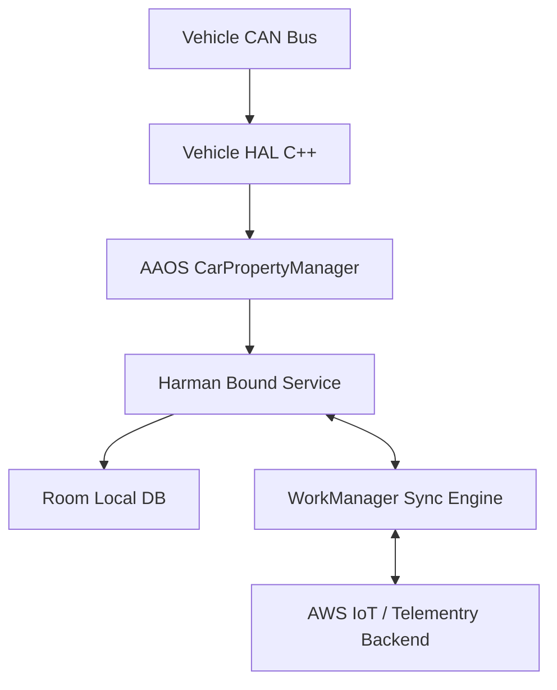

# System Design: Vehicle Health & Telematics (Staff Level)

This document outlines the architecture, data flow, and critical edge cases for an embedded Android Automotive OS (AAOS) service bridging vehicle hardware with cloud analytics.

---

## 1. Requirements & Constraints
*   **Functional:** Read 100+ sensors (RPM, Tire Pressure, Engine Temp) directly from the vehicle, perform edge calculations, and reliably sync them to the backend.
*   **Non-Functional (Performance):** Zero jank allowed on the Head Unit. Negligible battery drain when the vehicle is parked.
*   **Non-Functional (Security):** Strict isolation so a malicious 3rd party app (like Spotify) cannot hack the engine block.

---

## 2. High-Level Architecture Diagram

---

## 3. Core Components & Data Flow

### A. IPC Data Ingestion (AIDL & VHAL)
Instead of a simple Activity, the core engine of this app is a persistent Service running constantly.
-   **The Bridge:** It communicates with the `CarPropertyManager`, registering callbacks for specific `VehiclePropertyIds`.
-   **Memory Optimization:** The VHAL triggers thousands of events per minute. Do not allocate objects inside the `onChangeEvent` loop. If caching states, use `ArrayMap<Int, Float>` instead of `HashMap` to avoid autoboxing overhead and save massive RAM.

### B. Edge Computing (Deltas over Raw Data)
**The Problem:** Shipping raw CAN bus text streams over cellular networks will cost thousands of gigabytes a month and drain the car's 12V battery.
-   **The Solution:** Program the Service to perform local **Edge Computing**. 
-   Instead of sending every GPS ping, buffer 15 minutes of GPS points locally in `Room`, calculate the average speed or draw a bounding polyline, convert it to a binary payload (`Protobuf`), and send one tiny packet.

---

## 4. Resilience & The "Garage Mode" Edge Case

**The Scenario:** Vehicles drive through tunnels and rural areas with no 4G service. Furthermore, drivers turn off their cars unannounced, cutting power abruptly.

**The Solution:**
1.  **Offline-First Buffer:** All calculated edge telemetry is written instantly to the local SQLite database.
2.  **Delayed Execution via Garage Mode:** 
    -   Do not run heavy JSON-serialization or network uploads while the driver is actively navigating and playing music (competing for CPU).
    -   When the driver parks and turns off the ignition, the AAOS display turns off, but the OS goes into **Garage Mode** for ~15 minutes.
    -   Use `WorkManager` with `NetworkType.CONNECTED` constraints. Android knows to unleash all deferred `WorkManager` jobs exclusively during Garage Mode, syncing the massive `Room` database to the cloud via Wi-Fi without degrading UI performance.

---

## 5. Security & Isolation

An automotive head unit is a shared environment. You must secure the IPC paths.

### A. SELinux (Mandatory Access Control)
Ensure that the telemetry service runs in an isolated Linux context. Even if a vulnerability is found in the service, SELinux `.te` policies will restrict the process from issuing hardware-level shell commands to the steering column.

### B. Signature Permissions
If building a custom AIDL API that exposes vehicle data to the Dashboard App, protect the binding.
-   Use `<permission android:name="harman.TELEMETRY" android:protectionLevel="signature"/>`.
-   In the Service `onBind()`, actively check `Binder.getCallingUid()`.
-   This ensures that only apps cryptographically signed by the same OEM keys can connect to your data stream, blocking random Play Store downloads from reading proprietary engine stats.
