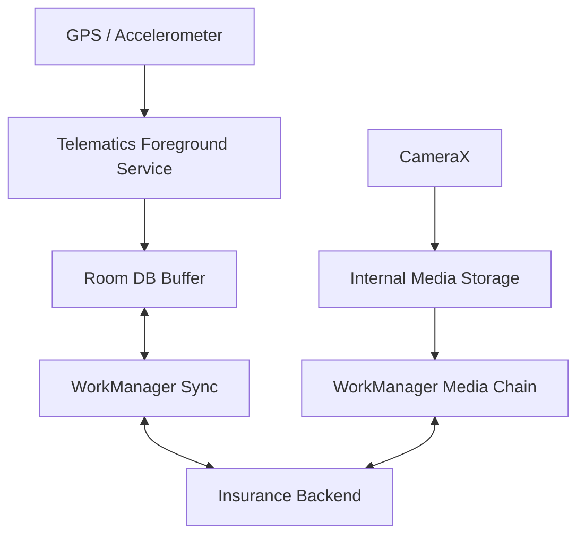

# System Design: Vehicle Insurance (Staff Level)

This document outlines the architecture and critical edge cases for a Vehicle Insurance mobile application. Unlike general insurance, vehicle insurance involves deep hardware integration (telematics), large media payloads for inspections, and location-based fraud prevention.

---

## 1. Requirements & Constraints
*   **Functional:** Allow users to buy/renew policies, capture 360-degree vehicle inspection videos/photos, and integrate with continuous telematics (driving behavior tracking).
*   **Non-Functional (Performance):** Continuous driving tracking must not drain the battery (strictly less than 3% per day). Video uploads must gracefully recover from dropped cellular connections.
*   **Non-Functional (Security):** Prove that inspection photos aren't spoofed or pulled from the device gallery.

---

## 2. High-Level Architecture Diagram

---

## 3. Core Components: Telematics Tracking

Tracking a user's driving behavior (Pay-How-You-Drive) is the most challenging component of a vehicle insurance app because of background restrictions.

### A. The "Ghost" Trip Detection
-   **Problem:** The user doesn't open the app before driving. How does the app know to start tracking speed and harsh braking?
-   **Solution:** Use the **Activity Recognition API** (Play Services).
    - Register a `PendingIntent` for `DetectedActivity.IN_VEHICLE`.
    - When the OS detects driving via accelerometer heuristics, it fires the `PendingIntent`, waking your app cleanly in the background.
    - The app immediately spins up a **Foreground Service** (`location` type) to read raw GPS and accelerometer data.

### B. Extreme Battery Optimization
-   **Problem:** 60 minutes of high-frequency GPS tracking will destroy battery life.
-   **Solution:**
    - Use `FusedLocationProviderClient` with `PRIORITY_BALANCED_POWER_ACCURACY` when moving slowly or parked, and only escalate to `PRIORITY_HIGH_ACCURACY` on highways.
    - Do not hold WakeLocks to process points. Buffer coordinates in memory and perform bulk-inserts to `Room` every 30 seconds.

---

## 4. Resilience: Video Inspection Uploads

A user renewing a lapsed policy must walk around the car and record a 1-minute 4K video.

### A. The "OOM & Drop" Edge Case
-   **Problem:** Rendering 4K video and uploading a 400MB file over a 3G connection in a basement garage.
-   **Solution:**
    1.  Limit the video recording via `MediaRecorder` or CameraX `VideoCapture` to 720p or 1080p natively; do not allow raw 4K.
    2.  Write the MP4 directly to `context.filesDir`.
    3.  Use a `OneTimeWorkRequest` with `NetworkType.CONNECTED` and `StorageNotLow`. 
    4.  If the TCP socket breaks midway, the backend must support **Multipart Chunked Uploads**. Android reads the file via `RandomAccessFile`, calculates the dropped byte offset, and resumes the upload exactly where it failed.

---

## 5. Security: Anti-Fraud Authenticity

Users may try to upload old photos of the car before a new scratch occurred.

### A. Media Keystore Signing
1.  Disable the standard "File Picker" intent. Force the user to use the in-app CameraX view.
2.  The millisecond the picture is taken, generate a SHA-256 hash of the byte array.
3.  Sign the hash using a **Hardware-Backed Keystore Key** (Titan M chip) that acts as the device's cryptographic identity.
4.  Send the photo, the signature, and the Android Key Attestation certificate. The backend verifies this, cryptographically proving the photo was taken natively on that hardware at that exact timestamp.
